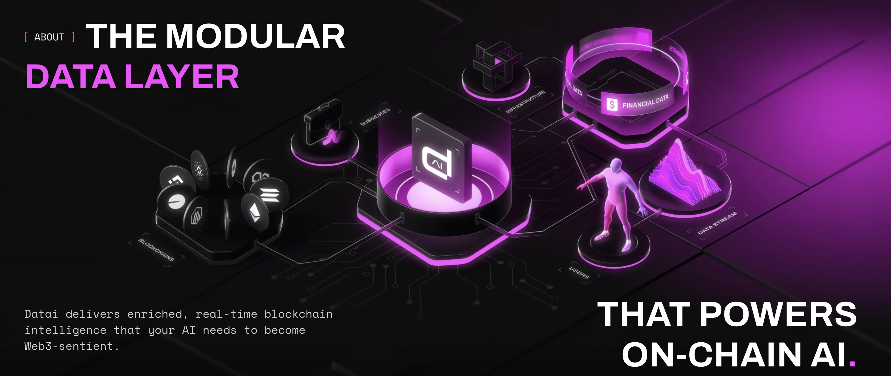

# Datai Projections SDK

> Easily integrate with the Datai decentralized data network and get rewarded


[](LICENSE)

The **Datai Projections SDK** empowers developers to rapidly build, manage, and integrate projections—specialized data integration modules—into the Datai decentralized data network. This SDK provides the tools you need to get started quickly.

---

## Table of Contents

- [Introduction](#introduction)
- [What is a Projection?](#what-is-a-projection)
- [Why should you implement a Projection?](#why-should-you-implement-a-projection)
- [What are the components of a projection?](#what-are-the-components-of-a-projection)
- [Getting Started](#getting-started)
  - [Prerequisites](#prerequisites)
  - [Installation](#installation)
- [Workflow](#workflow)
- [Contributing](#contributing)
- [Community and Support](#community-and-support)
- [License](#license)

---

## Introduction

The Datai Projections SDK is a modular library designed to simplify the process of integrating with our decentralized data network. It is intended for developers who want to create custom integrations, contribute new functionalities, or extend the capabilities of the Datai ecosystem.

For an in-depth guide on building your first projection, please see our [Developer Documentation](https://datai.network/docs/developers/developing-your-first-projection/).

This document will first describe in general terms how the Datai Network works and who is participating in this ecosystem. Then the document will focus on Developers and on how to implement a projection.

---

## Datai Network



### What is Datai Network?

Datai Network (DN) is a peer-to-peer network that indexes various blockchains and responds to external queries. It’s a distributed system where nodes collaborate to store essential information like node identities, roles, projection deployment details, active account states, and more. Each DN Node holds a part of this information, working together to maintain the network.

### What are the different actors within the Datai Network?

#### Developers

Developers can contribute to the network by adding projections to increase data coverage and therefore earning $Datai tokens for your work

#### Nodes

Nodes can choose to be either Indexer or Gateway, which are the backbone of the network. Indexer nodes are responsible for indexing the projections submitted by developers, while Gateway nodes provide data to users by matching their requests to the relevant indexer nodes hosting the desired projections.

#### Data Consumers

Data consumers mainly consume data from the network, fueling the ecosystem by using Datai Tokens or Stablecoins to pay for requests as well as use our in-house apps and APIs.

### Economics

- Developers are staking DATAI tokens when a projection is registered. These tokens will be staked for 6 months.
- Nodes are staking DATAI tokens when running either an Indexer or a Gateway.
- Consumers are paying to consume data from the Datai Network, either in Stablecoins or in DATAI token.
- After each epoch (1 day), balances are deducted from Consumers based on the amount of requests and rewards are distributed to Nodes and Developers in form of DATAI Token
- Disputes may be created by anyone finding a bug, causing the Developer or the Disputer being slashed.
- After 6 months, the Developer may withdraw the initial stake and potentially collect the Projection Grant.

---

## Projections

This is the specific section for Developers who want to use this repository to start contributing to the Datai Network.

### What is a Projection?

A projection is a bundle of code implemented by a developer who wants to integrate a specific protocol into the Datai Network. The Datai engine compiles these projections and deploys them to IPFS for indexers to run on their nodes.

This modular approach is key to expanding the network’s reach and utility.

### Why should you implement a Projection?

The network rewards developers for each projection they have deployed. Not only do developers receive rewards from data consumers, they are also eligible to claim staked grants on the projection.

### What are the components of a projection?

A projection has two main components which will contribute to calculate the active positions previously explained:

#### Subgraph

Indexes relevant events, such as a user staking tokens in a contract. The subgraph stores data about these positions, identifying users with open positions. This helps the next component focus only on these users rather than analyzing the entire user base.

#### Watcher

Periodically analyzes positions stored by the subgraph and calculates the active position balances.

---

## Getting Started

Before you begin, make sure you have the following installed:

### Prerequisites

- [Docker](https://docs.docker.com/get-started/get-docker/)
- [Node.js (v14+)](https://nodejs.org/)
- [npm](https://www.npmjs.com/) or [Yarn](https://yarnpkg.com/)
- Code editor of your choice. We recommend [Visual Studio Code](https://code.visualstudio.com/)
- Experience with [The Graph Protocol](https://thegraph.com/docs/en/subgraphs/developing/creating/starting-your-subgraph/) is going to make your life very easy and most of the guide will be very familiar to you. In fact we encourage you to spend some time learning about it.

### Installation

There is no need to clone the repo from Github. You can simply run the following to get a simpler version for you to start the development.

```bash
npx create-datai-app
```

---

## Workflow

During the implementation process, you will have to go through the following phases:

### Commitment

On the Datai Network, participants are held responsible to their commitments to ensure the integrity of the data. A commitment is a financially secured promise to deliver a projection by a certain date. When you commit to a projection, you are expected to deliver it by the agreed-upon date. If you fail to deliver the projection by the agreed-upon date, your stake will be moved as a grant towards the next developer who is willing to commit, and deliver a given projection.

For further details, please refer to our [Developer Documentation](https://datai.network/docs/developers/commitment/).

### Implementation

This is the phase where the developer implements the previously committed projection. This is the longest phase, and to get all the details, please refer to our [Developer Documentation](https://datai.network/docs/developers/developing-your-first-projection/).

### Testing & Deployment

Once the implementation is complete, the developer must carefully test it on their local machine before deploying the project to the public IPFS. It is crucial to pay attention to the quality of the data, as future bugs may be discovered by third parties, which could lead to penalties.

Please refer to our [Developer Documentation](https://datai.network/docs/developers/testing-and-deployment/) for further details.

### Earn rewards & maintenance

Now is the time where you developer are rewarded for your great work. After each epoch, you can claim your rewards until your projection is expired (normally after 6 months).

It's also time to pay attention, because if anyone finds a bug in your projection, a Dispute will be created and the bug will have to be addressed.

Please refer to our [Developer Documentation](https://datai.network/docs/developers/projection-rewards/) for further details.

### Claim Grant and withdraw deposit

This is the final stage, where the developer can claim the Projection Grant (if it exists) and withdraw the initial deposit. Once the deposit is withdrawn, the developer is no longer responsible of the projection and the maintenance is over.

---

## Contributing

We welcome contributions to improve the SDK and expand the Datai network's capabilities. To get started:

1. **Fork** the repository.
2. **Create a new branch** for your feature or bug fix:
   ```bash
   git checkout -b feature/your-feature-name
   ```
3. **Commit** your changes:
   ```bash
   git commit -m "Add some feature"
   ```
4. **Push** to your branch:
   ```bash
   git push origin feature/your-feature-name
   ```
5. **Submit a pull request** detailing your changes.

For more details, please review our [Contribution Guidelines](CONTRIBUTING.md) and [Code of Conduct](CODE_OF_CONDUCT.md).

---

## Community and Support

Join our community to discuss ideas, get help, and share your integrations:

- **[Website](https://datai.network/)**
- **[Telegram](http://t.me/Datai_network)**
- **[Discord Channel](https://discord.gg/CKCgU3MegH)**
- **[X (formerly Twitter)](https://x.com/datainetwork)**

If you encounter any issues or have questions, please open an issue in this repository or reach out via our community channels.

---

## License

This project is licensed under the [MIT License](LICENSE).

---

Happy coding, and thank you for contributing to the Datai decentralized data network!

```

```
